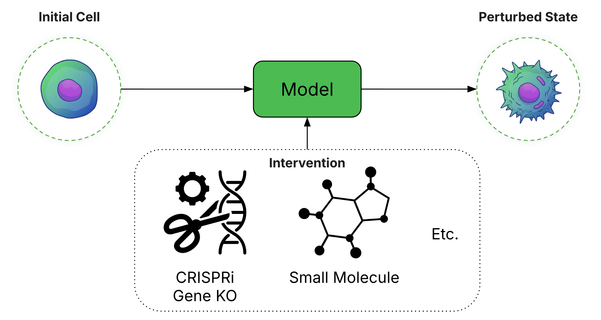

# Foundation Models Improve Perturbation Response Prediction



*Foundation Models Improve Perturbation Response Prediction* is a large-scale analysis of biological foundation models in the context of perturbation response prediction. This work was conducted by [GenBio AI](https://genbio.ai/).

In this work, we:
* Analyze over 600 models.
* Consider both chemical and genetic perturbation datasets.
* Study continuous (log fold-change) and discrete (DEG prediction) formulations of perturbation prediction. 
* Estimate upper and lower bounds on achievable performance. 

Key findings include:
* Many FMs outperform simple baselines like PCA. 
* In some cases, FMs can approach experimental error limits. 
* Attention-based multimodal fusion improves performance. 
* Many "advanced" perturbation prediction methods (e.g. GEARS, latent diffusion, flow matching) underperform FMs. 
* Small molecule perturbations are significantly more challenging to predict than gene knockouts. 

For more details:
* [GenBio AI Blog Post](https://genbio.ai/foundation-models-improve-perturbation-response-prediction/)
* [Paper](https://www.biorxiv.org/content/10.64898/2026.02.18.706454v1)

## Abstract
Predicting cellular responses to genetic or chemical perturbations has been a long-standing goal in biology. Recent applications of foundation models to this task have yielded contradictory results regarding their superiority over simple baselines. We conducted an extensive analysis of over 600 different models across various prediction tasks and evaluation metrics, demonstrating that while some foundation models fail to outperform simple baselines, others significantly improve predictions for both genetic and chemical perturbations. Furthermore, we developed and evaluated methods for integrating multiple foundation models for perturbation prediction. Our results show that with sufficient data, these models approach fundamental performance limits, confirming that foundation models can improve cellular response simulations. 

## Data and Embeddings

Preprocessed data and embeddings are available on [HuggingFace](https://huggingface.co/datasets/genbio-ai/foundation-models-perturbation/tree/main).

## Embedding Benchmarking Experiments

Code to reproduce our embedding benchmarking expreiments (including multimodal fusion experiments) can be found in `benchmark`. See `benchmark/README.md` for details. 

## Cross-Context Experiments

Code to reproduce our cross-context experiments (including comparisons to STATE) can be found in `cross_context`. See `cross_context/README.md` for details. 

## Generative Model Training

Code to train minimal generative models (Flow Matching, Latent Diffusion, Schrodinger Bridge) for perturbation prediction can be found in `train_generative`. See `train_generative/README.md` for details. 

## GNN-Based Pretraining

Code to reproduce the `STRING GNN` embeddings can be found in `train_gnn`. See `train_gnn/README.md` for details. 

## Figures

In `results` we provide pre-computed results and code to generate the figures in our paper. 

## License

Our work is provided under the [GenBio AI Community License](LICENSE.txt).

## Reference

If you find our work useful, consider citing our paper:

```
@article{cole2026foundation,
  title={Foundation Models Improve Perturbation Response Prediction},
  author={Cole, Elijah and Huizing, Geert-Jan and Addagudi, Sohan and Ho, Nicholas and Hasanaj, Euxhen and Kuijs, Merel and Johnstone, Toby and Carilli, Maria and Davi, Alec and Ellington, Caleb and others},
  journal={bioRxiv},
  year={2026}
}
```
